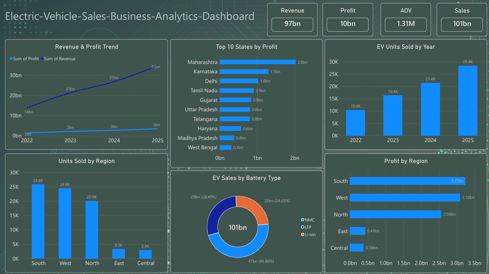

# Electric-Vehicle-Sales-Business-Analytics-Dashboard

Electric vehicle sales analysis using Python, Pandas, Excel, and Power BI with an interactive business analytics dashboard.

This is an end-to-end Business Analytics project focused on analyzing Electric Vehicle (EV) sales data. The project covers data cleaning and preprocessing using Python and Pandas, exploratory data analysis, KPI calculation, business insights, and interactive dashboard development using Power BI.

---

## 📊 Dashboard Preview

---

## 🎯 Project Objective

The main objective of this project is to analyze EV sales data and identify important business trends related to:

- Revenue and profit growth
- EV unit sales
- Regional performance
- State-wise profitability
- Battery type sales
- Average Order Value (AOV)
- Year-wise sales performance

The analysis helps transform raw sales data into meaningful business insights for decision-making.

---

## 🛠️ Tools & Technologies

- **Python**
- **Pandas**
- **Jupyter Notebook**
- **Microsoft Excel**
- **Power BI**
- **DAX**
- **CSV**

---

## 📄 Project Files

| File | Description |
|---|---|
| `EV_Sales_Original_DataSet.csv` | Original/raw EV sales dataset |
| `EV_Sales_Processed_DataSet.csv` | Cleaned and processed dataset |
| `EV_Sales_Pandas_Data_Cleaning.ipynb` | Python/Pandas data cleaning and analysis |
| `Dashboard_Power_BI.pbix` | Power BI dashboard |
| `Dashboard_Preview_Image.png` | Dashboard preview image |
| `Units_sold_by_State.png` | State-wise EV unit sales visualization |
| `Key_Insights.md` | Key business insights |
